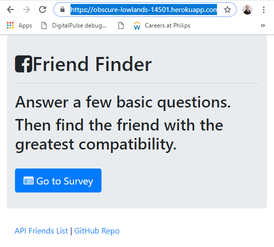
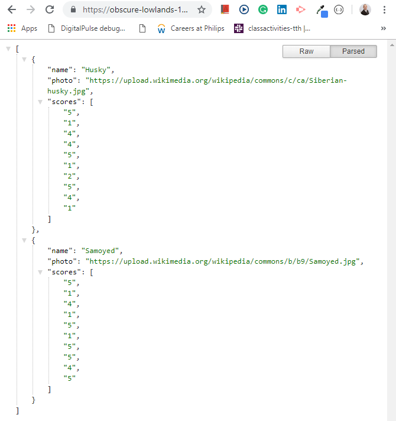
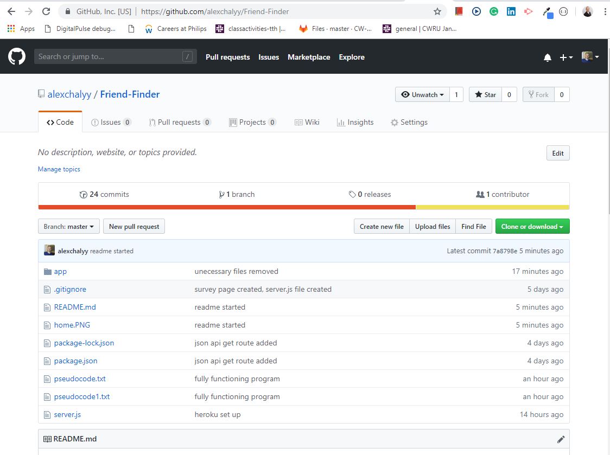
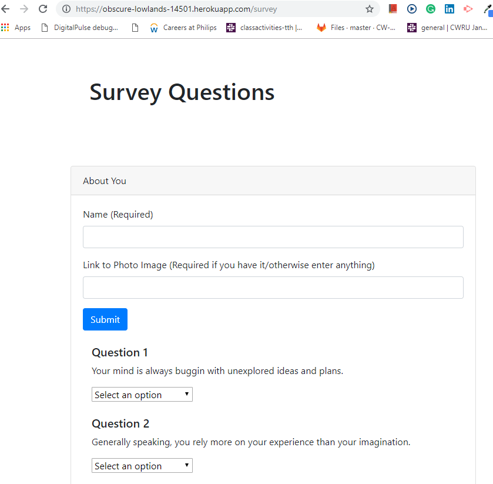
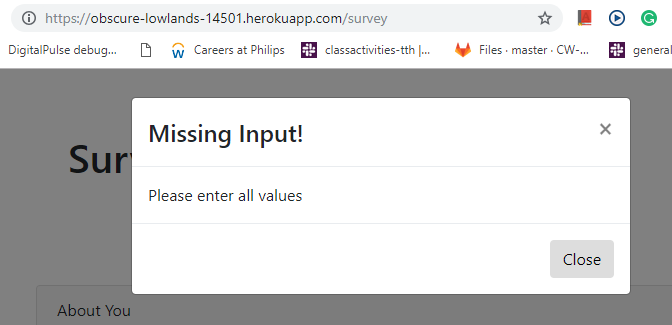
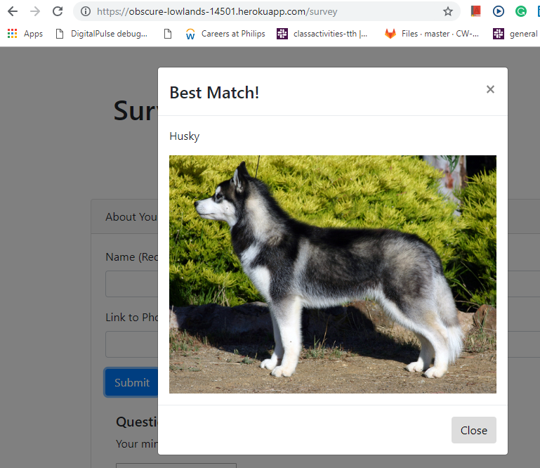

# Friend-Finder

# Homework Description

# Home Page

At the beginning, when user goes to the website url (https://obscure-lowlands-14501.herokuapp.com/), user is navigated to the homepage describing the "Friend Finder" web site (as shown below).

The home page contains several links:

* When API Friends List link is clicked, a JSON array of json object array database of "Friends" is displayed that contains their names, photos, and their answers to compatibility quiz questions (two values by default) as shown in the screenshot below:

* When GitHub Repo link is clicked, appropriate GitHub Repo page is opened (shown below).

* When the user clicks on "Go to Survey" button, survey page is opened as shown below:

# Survey Page

The survey page (as shown above) contains text boxes for name and photo link (anything could be entered). It also contains 10 questions with answer options of 1-5. It also contains submit button. "API Friends List" and "GitHub Repo" links are included as well and function in the same way as on the home page.

The user must fill all information out for the form to be processed. If any information is missing, a proper input validation message is shown when submit button is clicked (shown below).

Other input validation is used as well.

If the user enters a proper "friend" information that has not been entered before, the json friend array is appended with new information, and a pop-up window is displayed with closest question score match "friend" to the freshly entered "friend" (shown below).

https://obscure-lowlands-14501.herokuapp.com/

# Homework Creation Process

The front end of application was written in static html and styled in bootstrap to be responsive. The back end of application was written in Javascript using jQueries, node.js, express, and path npm packages. The whole application was than hosted on heroku.
